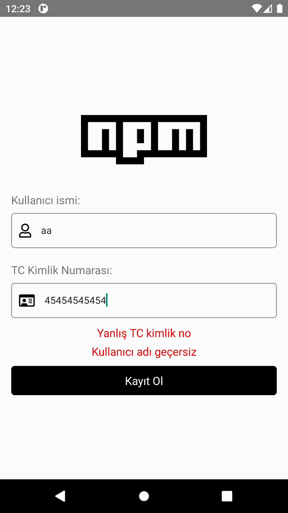
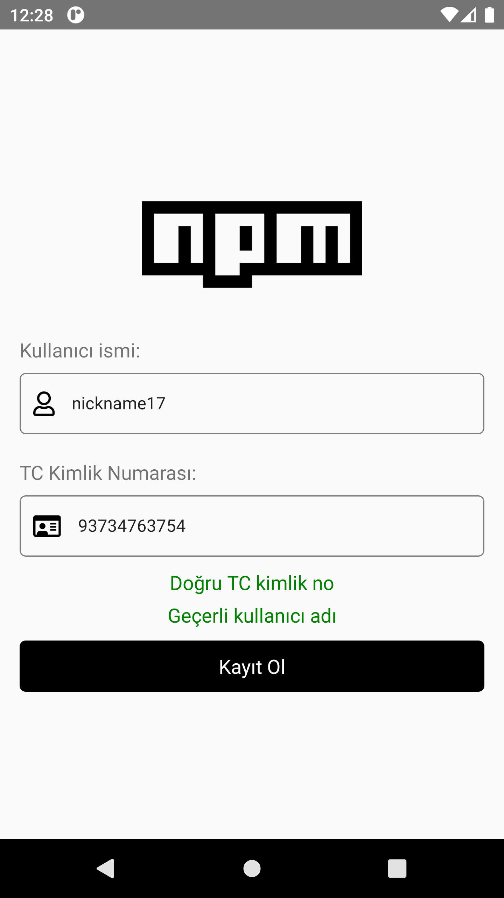
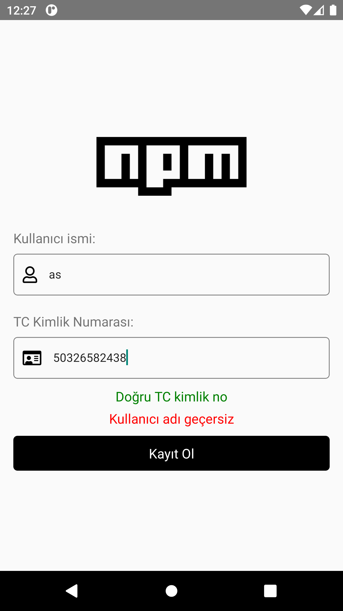

# React Native TCKN Validator

This is a React Native application that utilizes the tckn-validator npm package to create a user registration page with username and Turkish identification number (TCKN) validation


## Installation

Before running the application, make sure you have completed the React Native environment setup and have created a new React Native project using @react-native-community/cli. Once you have set up your project, follow these steps:

The link to my created npm package is: https://www.npmjs.com/package/tckn-validator   [](https://www.npmjs.com/package/tckn-validator)

Step 1: Install the tckn-validator package using npm or Yarn:

```bash
# using npm
npm install tckn-validator

# OR using Yarn
yarn add tckn-validator
```

## Screenshots

 |  | 


